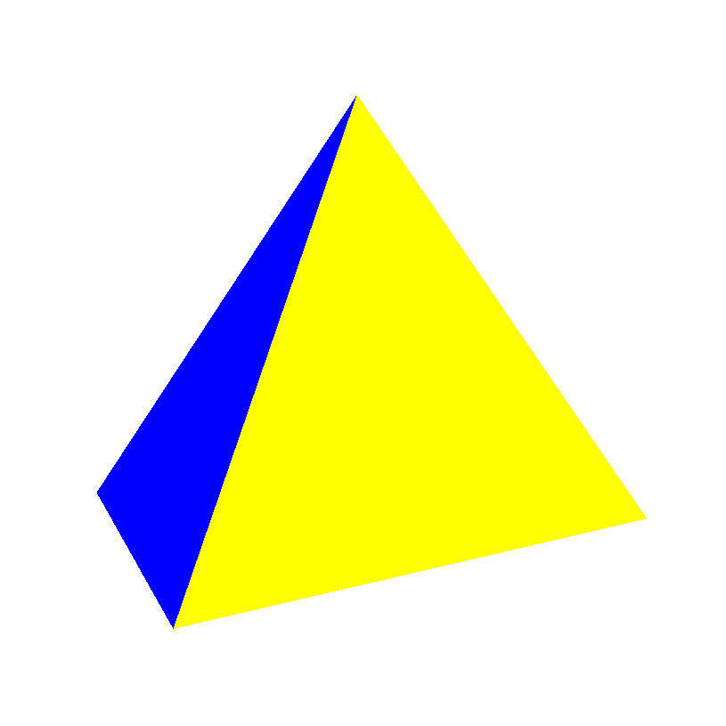
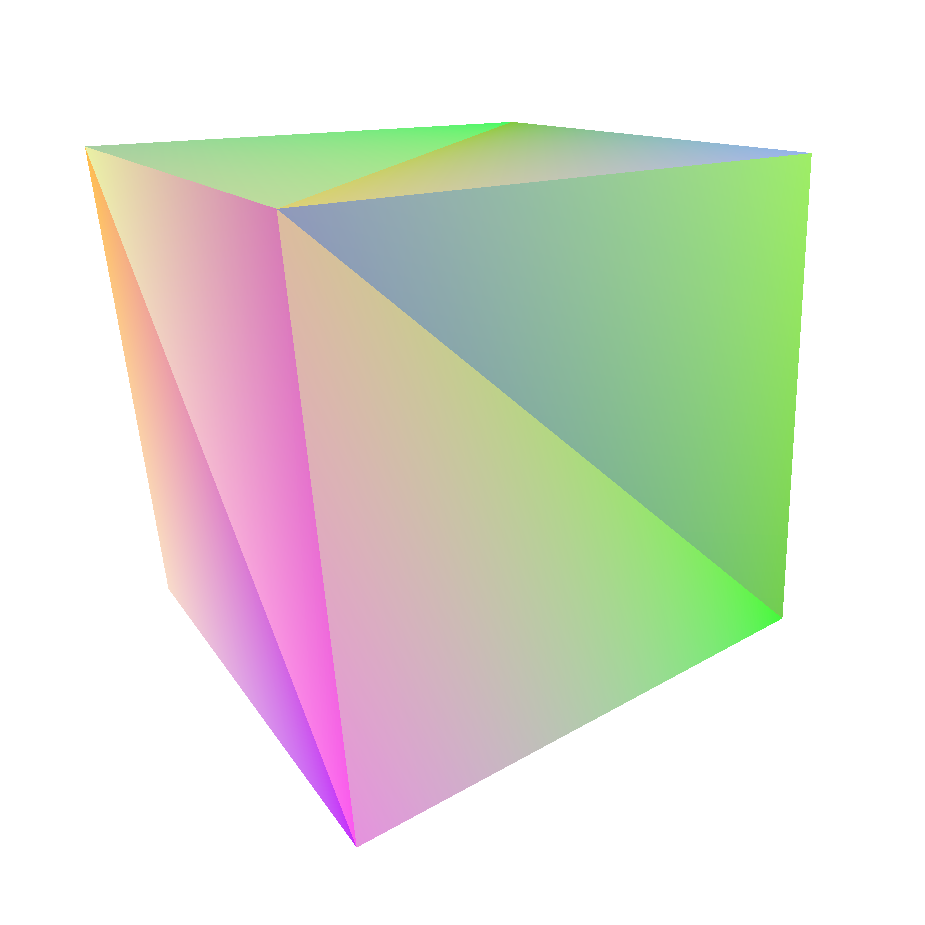

# rasterizer
### A Simple Software Rasterizer

|  | 
|:---:|:---:|

A simple CPU/software rasterizer implemented as a small, dependency-less rust library. A sample 3D "game" can be found in the example/ directory.
Current features are:
 - depth-buffering
 - sub-pixel precision
 - perspective correct vertex color interpolation
 - An alternative line-drawing mode using bresenham's (with clipping)
